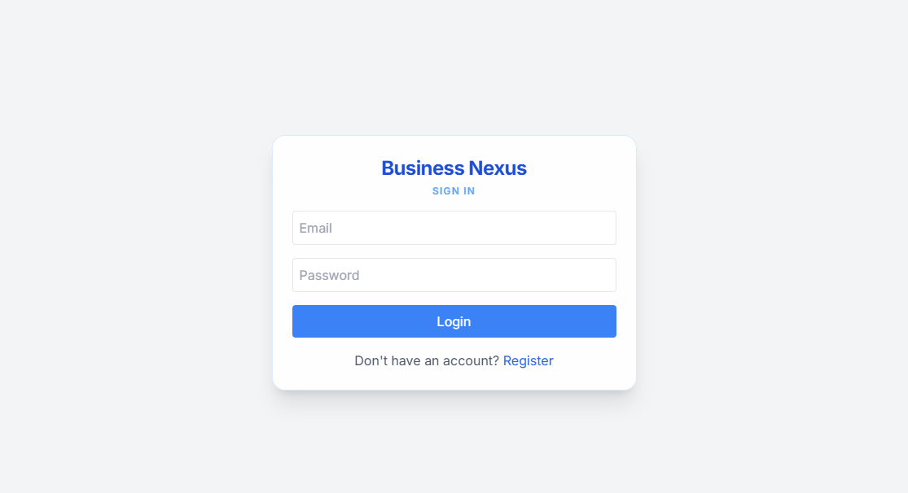
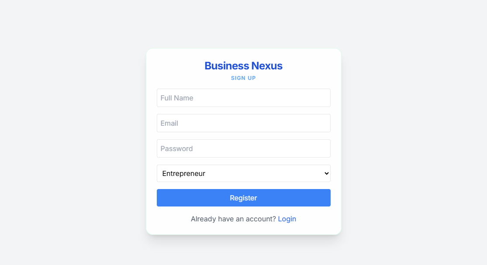
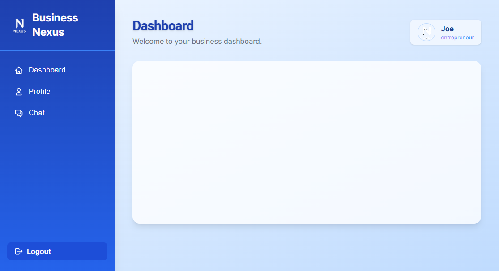
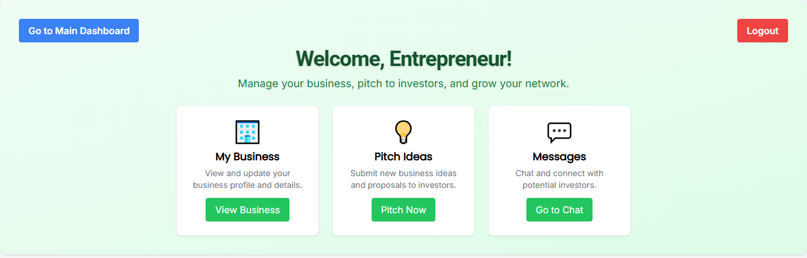
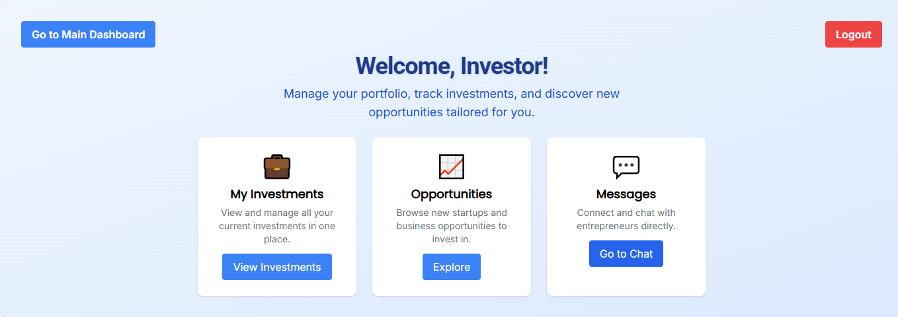

# Business Nexus

Business Nexus is a networking platform connecting entrepreneurs with investors. The platform enables entrepreneurs to showcase their startups while allowing investors to discover opportunities and initiate collaborations.


## 📊 UI Preview

*Login Page*

*Register Page*

*Dashboard Page*

*Dashboard Entrepreneur*

*Dashboard Investor*


## ✨ Key Features

### 🔒 Authentication System
- **Login**: Secure role-based authentication with form validation
- **Registration**: New user signup with email verification simulation
- **Protected Routes**: Role-based redirection (Investor/Entrepreneur)

### 🗺️ Navigation
- React Router with protected routes
- Responsive dashboard layout
- Dynamic sidebar navigation

### 🎨 UI Components
- Reusable design system (Buttons, Inputs, Cards)
- Tailwind CSS for consistent styling
- Mobile-responsive layouts

## 🛠️ Technology Stack

| Category        | Technologies                          |
|-----------------|---------------------------------------|
| Frontend        | React.js (Vite), Tailwind CSS         |
| Routing         | React Router v6                       |
| State Management| Context API                           |
| Mock API        | JSON Server                           |
| HTTP Client     | Axios                                 |
| Version Control | Git                                   |

## 📂 Project Structure

```bash
business-nexus/
├── public/
│   ├── mock-data/
│   │   └── db.json           # Mock user data for JSON Server
├── src/
│   ├── components/
│   │   ├── auth/
│   │   │   ├── LoginForm.jsx
│   │   │   └── RegisterForm.jsx
│   │   ├── common/
│   │   │   ├── Button.jsx
│   │   │   ├── Input.jsx
│   │   │   └── Card.jsx
│   ├── layouts/
│   │   └── DashboardLayout.jsx
│   ├── pages/
│   │   ├── Login.jsx
│   │   ├── Register.jsx
│   │   ├── InvestorDashboard.jsx
│   │   ├── EntrepreneurDashboard.jsx
│   │   ├── InvestorProfile.jsx
│   │   ├── EntrepreneurProfile.jsx
│   │   └── Chat.jsx
│   ├── utils/
│   │   └── api.js            # Axios setup for API calls
│   ├── App.jsx               # Main app with routing
│   ├── index.css             # Tailwind CSS setup
│   └── main.jsx              # Entry point
├── package.json              # Dependencies and scripts
└── README.md                 # Project documentation

```


## 🚀 Getting Started

## Prerequisites
- Node.js (v18+ recommended)
- npm (v9+ recommended)


## Setup Instructions

1. **Clone the Repository**:
   ```bash
   git clone https://github.com/your-username/business-nexus.git
   cd business-nexus
   ```

2. **Install Dependencies**:
   ```bash
   npm install
   ```

3. **Install JSON Server** (if not installed globally):
   ```bash
   npm install -g json-server
   ```

4. **Run JSON Server**:
   In a separate terminal, start the mock API:
   ```bash
   json-server --watch public/mock-data/db.json --port 3001
   ```

5. **Run the Development Server**:
   ```bash
   npm run dev
   ```
6. **Test Authentication**:

   Open `http://localhost:5173` in your browser.
  - **Login**: Use `investor@example.com` with `investor123` or `entrepreneur@example.com` with `entrepreneur123`.
   - **Register**: Create a new user with a unique email, password, name, and role.


| Role          | Email                   | Password        |
|---------------|-------------------------|-----------------|
| Investor      | investor@example.com    | investor123     |
| Entrepreneur  | entrepreneur@example.com| entrepreneur123 |


---


## 📅 Development Roadmap

### Week 1 (Completed)
✅ Authentication system  
✅ Core routing structure  
✅ Dashboard layout  
✅ Design system foundation  

### Week 2 (Current)
- Investor dashboard with entrepreneur listings
- Entrepreneur dashboard with collaboration requests
- Profile view templates

### Week 3
- Real-time chat functionality
- Profile enhancement features
- UI polish and animations

### Week 4
- Comprehensive testing
- Performance optimization
- Deployment preparation


---

**Note**: This project is currently in active development as part of a 4-week internship program.

