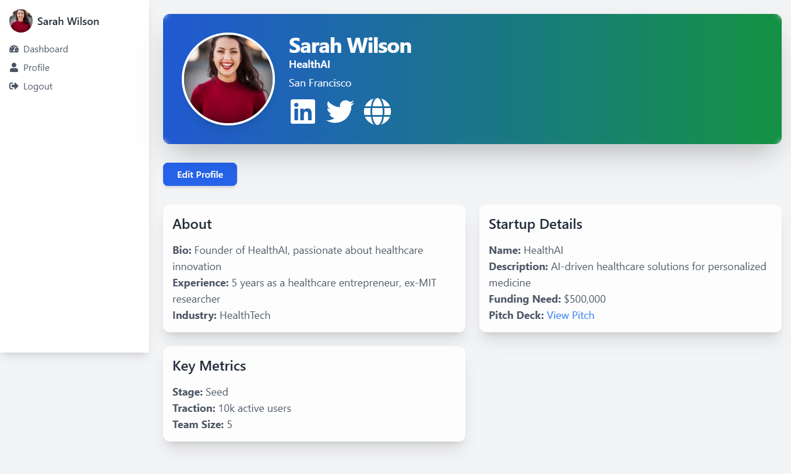

# Business Nexus

Business Nexus is a networking platform connecting entrepreneurs with investors. The platform enables entrepreneurs to showcase their startups while allowing investors to discover opportunities and initiate collaborations.

*Now powered by a scalable Node.js backend deployed on Render*

## 📊 UI Preview





## 🚀 Live Deployments
- **Main Demo**: [Vercel](https://business-nexus-phi.vercel.app)
- **Mirron Demo**: [Netlify](https://business-nexuss.netlify.app)
- **Backend API**: [Render](https://business-nexus-backend.onrender.com)

[](https://business-nexus-phi.vercel.app)
[](https://business-nexuss.netlify.app)
[](https://business-nexus-backend.onrender.com)


## ✨ Key Features

### 🔒 Authentication System
- **Login**: Secure role-based authentication with form validation
- **Registration**: New user signup with email verification simulation
- **Protected Routes**: Role-based redirection (Investor/Entrepreneur)

### 🗺️ Navigation
- React Router with protected routes
- Responsive dashboard layout
- Dynamic sidebar navigation

### 💬 Real-Time Communication
- Socket.IO powered chat
- Typing indicators & read receipts
- Conversation history
- Mobile-responsive interface

### 🎨 UI Components
- Reusable design system (Buttons, Inputs, Cards)
- Tailwind CSS for consistent styling
- Mobile-responsive layouts

### 📊 Dynamic Dashboards
- **Investor View**:
  - Curated startup listings
  - Advanced filtering (industry, funding stage)
  - Quick-connect functionality

- **Entrepreneur View**:
  - Request management hub
  - Investor analytics
  - Connection metrics

## Features (Week 2)

- **Investor Dashboard**: Displays a list of entrepreneurs with name, startup name, description, and funding needed. Links to individual profiles.
- **Entrepreneur Dashboard**: Shows collaboration requests from investors with name, profile snippet, and status.
- **Profile Pages**: Placeholder pages for investor and entrepreneur profiles, fetching data from JSON Server.


## Features (Week 3)

- **Backend**: Node.js + MongoDB with enhanced User schema (socialLinks, experience, industry, stage, traction, teamSize). Improved PUT /users/:id for profile updates. Updated data.json with Unsplash avatar URLs. Deployed on Render.
- **Investor Dashboard**: Concise entrepreneur cards via EntrepreneursList.
- **Entrepreneur Dashboard**: Collaboration requests via InvestorsRequests with fixed continuous requests and reject action.
- **Profile Pages**: Enhanced UI with sticky sidebar, social media icons (LinkedIn, Twitter, Website), glassmorphism cards, larger avatar with bounce animation, and hover effects. Fixed Edit Profile form with correct onUpdate callback and avatar URL validation.
- **Chat**: Two-panel layout (chat list, messages), glassmorphism, Socket.IO for real-time messaging, typing indicators, read receipts, auto-scroll, mobile toggling, and WebSocket error handling. Refactored into reusable components:
  - `ChatList`: Renders collaborator list with avatars, names, roles, and tooltips.
  - `ChatHeader`: Displays chat header with back button, collaborator avatar, name, and tooltip.
  - `ChatMessages`: Shows message list, typing indicator, and auto-scroll.
  - `ChatInput`: Manages message input and send button with typing events.
- **Routing**: Uses /profile/:role/:id and /chat/:role/:id with ProtectedRoute.
- **Navigation**: Dynamic dashboard and chat links in sidebar.
- **Profile Editing**: PUT /users/:id with avatar upload, social links, experience, industry, stage, traction, teamSize, and profile description. 
- **Error Handling**: Improved error messages and error boundaries for better user experience.
- **Code Quality**: Improved code organization, naming conventions, and comments for better readability and maintainability.


## 🛠️ Technology Stack

| Category        | Technologies                          |
|-----------------|---------------------------------------|
| Frontend        | React.js (Vite), Tailwind CSS         |
| Routing         | React Router v6                       |
| State Management| Context API                           |
| Mock API        | JSON Server (By default uses render)                          |
| HTTP Client     | Axios                                 |
| Version Control | Git                                   |

## 📂 Project Structure

```bash
src/
├── api/                  # Axios instance and API calls
├── assets/               # Static assets
├── components/           # Reusable components
│   ├── auth/             # Authentication forms
│   ├── chat/             # Real-time chat components
│   ├── dashboard/        # Dashboard widgets
│   └── profiles/         # Profile components
├── context/              # Global state management
├── hooks/                # Custom React hooks
├── layouts/              # Application layouts
├── pages/                # Route-level components
├── routes/               # Routing configuration
├── styles/               # Global styles
└── utils/                # Utility functions

```


## 🚀 Getting Started

## Prerequisites
- Node.js (v18+ recommended)
- npm (v9+ recommended)


## Setup Instructions (Locally - JSON Server)

1. **Clone the Repository**:
   ```bash
   git clone https://github.com/thisisnotasad/Business-Nexus.git 
   cd business-nexus
   ```

2. **Install Dependencies**:
   ```bash
   npm install
   ```

3. **Install JSON Server** (if not installed globally):
   ```bash
   npm install -g json-server
   ```

4. **Run JSON Server**:
   In a separate terminal, start the mock API:
   ```bash
   json-server --watch public/mock-data/db.json --port 3001
   ```

5. **Run the Development Server**:
   ```bash
   npm run dev
   ```
6. **Test Authentication**:

   Open `http://localhost:5173` in your browser.
  - **Login**: Use `john@investor.com` with `Invest123!` or `sarah@entrepreneur.com` with `Startup456!`.
   - **Register**: Create a new user with a unique email, password, name, and role.


| Role          | Email                   | Password        |
|---------------|-------------------------|-----------------|
| Investor      | john@investor.com    |Invest123!   |
| Entrepreneur  | sarah@entrepreneur.com| Startup456! |

## Production (uses Render backend by default)

### Running the App
```bash
npm run dev
```
Open [http://localhost:5173](http://localhost:5173) in your browser.

## 🌟 Key Improvements with Render Backend
✅ **Real database persistence** - MongoDB Atlas integration  
✅ **Production-ready API** - Proper error handling and status codes  
✅ **WebSocket support** - True real-time communication  
✅ **Scalable infrastructure** - Handles increased traffic seamlessly  


## 📅 Development Roadmap

### Week 1 (Completed)
- Authentication system  
- Core routing structure  
- Dashboard layout  
- Design system foundation  

### Week 2 (Completed)
- Investor dashboard with entrepreneur listings
- Entrepreneur dashboard with collaboration requests
- Profile view templates

### Week 3 (Completed)
- Real-time chat functionality
- Profile enhancement features
- UI polish and animations

### Week 4 (Compiled)
- Comprehensive testing
- Performance optimization
- Deployment preparation


---

**Note**: This project is currently in active development as part of a 4-week internship program. 

**Not Anymore**. 

